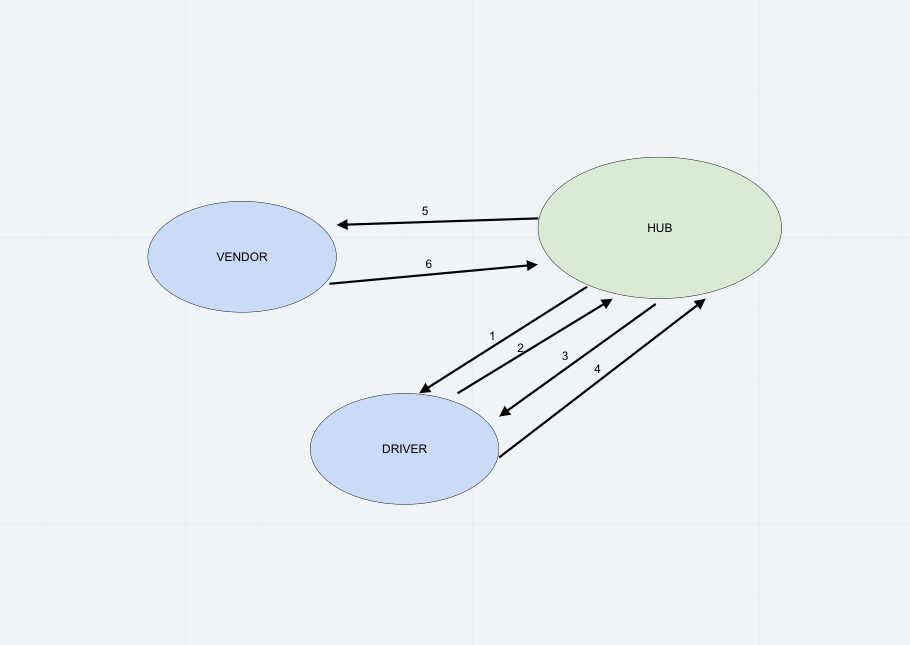

# LAB: Event Driven Applications

CAPS Phase 1: Begin the build of an application for a company called CAPS - The Code Academy Parcel Service. In this sprint, we’ll build out a system that emulates a real world supply chain. CAPS will simulate a delivery service where vendors (such a flower shops) will ship products using our delivery service and when our drivers deliver them, be notified that their customers received what they purchased.

## Author: Carly Dekock

## [Link to GitHub repository](https://github.com/carlydekock/caps.git)
## [Link to PR](https://github.com/carlydekock/caps/pull/1)

## Deployed links

- [Link to GitHub actions](https://github.com/carlydekock/caps/actions)

## The Setup

### How to install

- Clone down repository from GitHub
- Run the command ```npm install``` to install dependencies (dotenv, faker, jest)
- create .env file with a STORE_NAME

### How to test

- Run the command ```npm test``` to test

## UML



## Credits and Collaborations

- Worked at lab table with Jason Q, Jason D, Nick M, and Bill
- Used faker: https://www.npmjs.com/package/faker
- Creating timestamps from [stackoverflow](https://stackoverflow.com/questions/10645994/how-to-format-a-utc-date-as-a-yyyy-mm-dd-hhmmss-string-using-nodejs)
