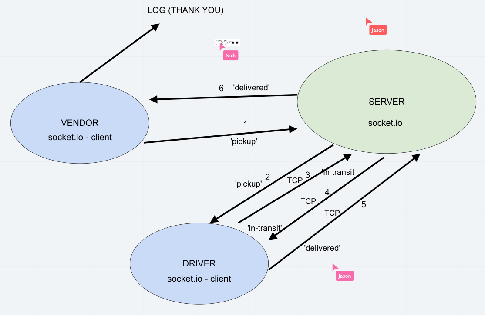

# LAB: Message Queues

- CAPS Phase 1: Begin the build of an application for a company called CAPS - The Code Academy Parcel Service. In this sprint, we’ll build out a system that emulates a real world supply chain. CAPS will simulate a delivery service where vendors (such a flower shops) will ship products using our delivery service and when our drivers deliver them, be notified that their customers received what they purchased.

- CAPS Phase 2: Continue working on a multi-day build of our delivery tracking system, moving event management to socket.io. In this phase, we’ll be moving away from using TCP for our event network and switching instead in to using socket.io, which takes on some of the complexity we had to manage ourselves, and also works equally well between servers and with websites. The intent here is to build the data services that would drive full dashboard where we can see pickups and deliveries as they happen.

- CAPS Phase 3: Complete work on a multi-day build of our delivery tracking system, adding queued delivery. In this phase, we’ll be adding a layer of complexity to our application. Rather than just “fire” events and hope that our vendors and drivers respond to them, we’re going to implement a “queue” system so that nothing gets lost. Every event sent will be logged and held onto by the server until the intended recipient acknowledges that they received the message. At any time, a subscriber can get all of the messages they might have missed. In this final phase, we’ll be building out the queue itself, getting our vendors subscribed to it, and focusing on just one event - delivered to set the pattern for subscribing to, and working with queues.

## Author: Carly Dekock

## [Link to GitHub repository](https://github.com/carlydekock/caps.git)
## [Link to PR](https://github.com/carlydekock/caps/pull/4)

## Deployed links

- [Link to GitHub actions](https://github.com/carlydekock/caps/actions)

## The Setup

### How to install

- Clone down repository from GitHub
- Run the command ```npm install``` to install dependencies (dotenv, faker, jest)
- Run the command ```npm install``` within server to install all dependencies (socket.io)
- Run the command ```npm install``` within driver, and vendor folders to install all dependencies (socket.io-client)
- create .env file with a STORE_NAME

### How to test

- Run the command ```npm test``` to test

## UML



## Credits and Collaborations

- Worked at lab table with Jason Q, Jason D, Nick M, and Bill
- Used faker: https://www.npmjs.com/package/faker
- Creating timestamps from [stackoverflow](https://stackoverflow.com/questions/10645994/how-to-format-a-utc-date-as-a-yyyy-mm-dd-hhmmss-string-using-nodejs)
